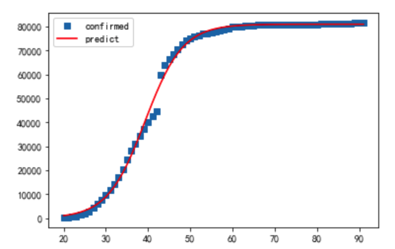
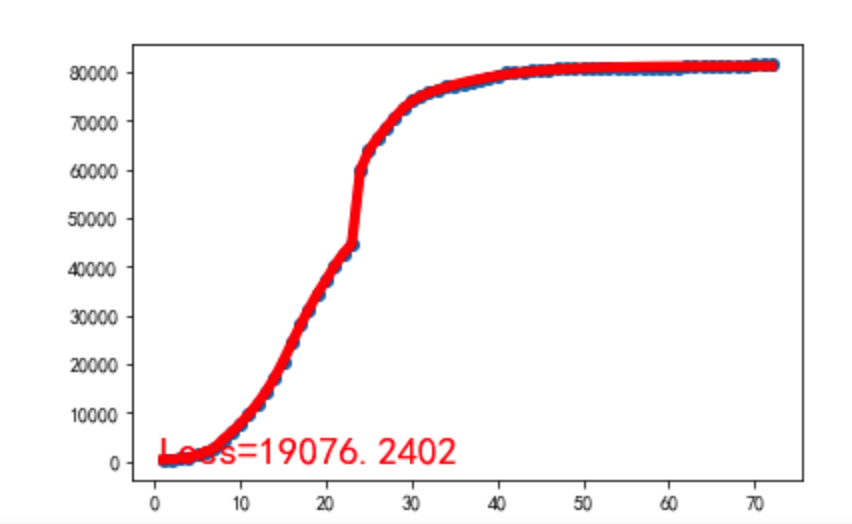
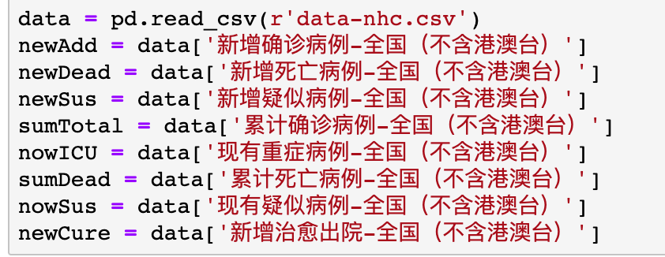
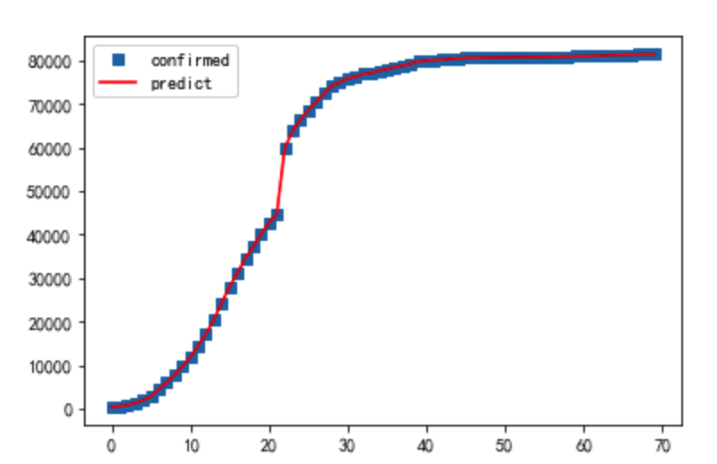
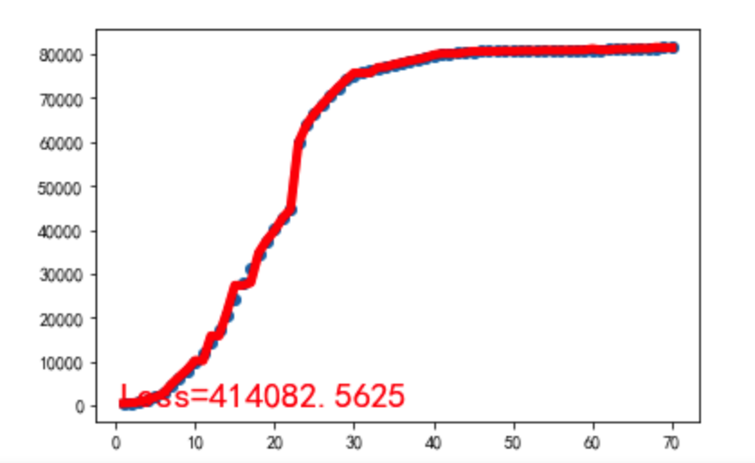

# 分工

#### 初稿（介绍部分，数据对比等分析可能来不及做，后天先讲重点）

#### 单特征（只按照累计确诊人数分析，数据来源截止到3.31）

###### 1、logistic回归拟合疫情曲线

生物中学的增长模型，类似S曲线的拟合，阅读文章：https://www.jianshu.com/p/4c90f8f7c1c1，代码为logistic.py拟合结果如下图（横坐标代表1月20号开始累增）：

##### 2、简单的神经网络拟合

构建一个简单的神经网络来拟合并预测未来疫情结果，代码为dpAsy.py

拟合效果如下：

## 多特征（累计七个特征）

##### 1、7个特征构建简单的神经网络拟合新冠曲线，参见manyFeatures.py

##### 2、xgboost中选用7个特征拟合的新冠曲线，参见xgboost.py

